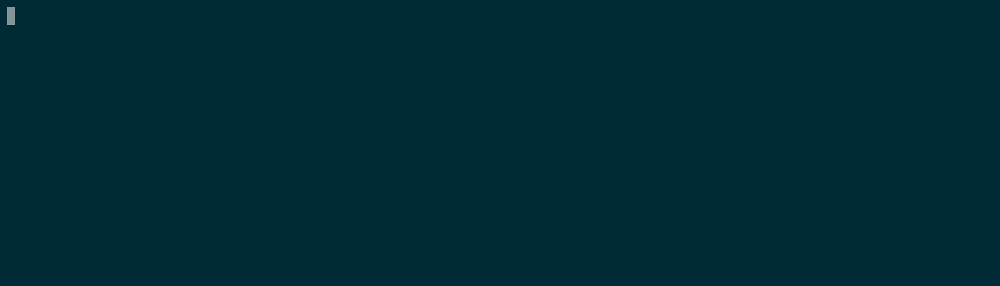

# ndove
> Let me show you my cool new website quickly!

ndove is a simple alternative to ngrok. All you need is a public server with SSH and socat installed and you can forward your local port!




## Dependencies

Building:
* argbash 
* rst2man2

Executing:
* ssh
* socat on public server

## Building

```bash
make
```

## Example usage

First make sure that a TCP server is running on your local machine. Then you can forward it like this:

```bash
./ndove.sh root@168.119.103.247 8000 8123 168.119.103.247 2a01:4f8:c17:fd96::1
```

If you need a description of the parameters you can use `./ndove.sh --help`. The parameters are:

|Parameter|Description|
|---|---|
|ssh-destination|SSH destination like user@host|
|private-port|Port on your development machine that you want to expose|
|public-port|Port at which you want to access your local post on the public server|
|public-ip4|The public IP where you want to have your local port exposed. Usually the same as the IP of the SSH server|
|public-ip6|Like `public-ip4` but for IPv6|


## Architecture

There is an overview of the architecture:


If you have any questions you can take a look at [this blog post](https://maxammann.org/posts/2020/10/ngrok-alternative-2/).

## Tricks and Tips

* You can use 0.0.0.0 as `public-ip4`. That way socat binds on all interfaces!
